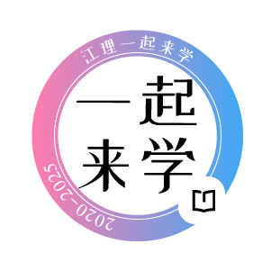

<h3>江理一起来学 / TogetherForStudy</h3>

江西理工大学多校区联动的学习生活信息共享和交流平台

✨ 用爱发电 · 知识共享 · 互助成长 ✨

   

 

---

## 我们是谁

江理一起来学是江西理工大学南昌校区软件工程学院20级史诗琪于2020年12月创建的非官方校园学习自媒体组织。崇尚互联网分享精神，助人为乐，用爱发电。现已发展为校内最大的学习组织，覆盖全校学生超 20000 人。

## 宗旨
我们致力于打造我校多校区联动的学习生活信息共享和交流平台，提供考试、考证、考研、就业、多方位能力提升等方面的信息、资源、科普及教学服务。

## 开源项目

jxust-yqlx-server：江理一起来学小程序服务端

jxust-yqlx-admin: 江理一起来学小程序管理端

jxust-yqlx-wxapp：江理一起来学小程序

## 社群交流

详见江理一起来学小程序-发现-交流群

## 社群职能

江理一起来学社群以促进我校学子交流进步、收集丰富资料库、科普必要知识为目的创建运营。我们热烈欢迎各位同学主动邀请你的同学、朋友、舍友加入社群，鼓励各位同学上传专业课资料文件、转发比赛通知公告等学习生活信息。

各分群群主、管理员将主动从学生手册，学校官网，个人经历，公众号文章等渠道获取知识，在群聊中积极帮助同学，热心解答问题，发扬江理一起来学精神。

将各学院、学部、管理部门等分散发布的各类学校通知、比赛通知、生活通知一并转发群内与所有校友形成信息共享。

将收集的各类专业课、公共课资料文件整理后上传至群共享，主管更新至江理资料库。

通过群公告、精华消息、@全体成员等途径发布人文精神指导下的考试、报名、缴费、选课、天气等各类提醒。

各群主管、管理员、校友可发挥主观能动性，为社群服务贡献力量。

## 0群说明

由于学生资料编写及整理意识低，一起来学资料库更新缺乏保障，仅依靠寥寥无几的热心同学投稿根本无法满足日益增长的资料需求。总体来看，相当一部分门类的课程，例如法学等，亟需补充。

大学里，信息就是价值，就是一切决策的基础，我们十分重视信息，但学校目前的通知体系尚不健全。我们都需要明确的是，大学里主动获取信息是至关重要的能力。因为我们不仅需要公开的信息，我们也可能需要更多其它对我们有用的小道消息。更重要的是，我们需要对信息的解读工作，以明白各种事情的轻重缓急和性价比。

为了解决这两个最大的问题，我们组建了江理一起来学0群，解决信息差和学习资源的问题。

如果你与我们志同道合，欢迎查看公众号的0群文章申请加入。

## 致谢

特别鸣谢参与资料制作、编写、分享，以及抹平信息差的每一位校园英雄。

完整名单请见公众号英雄榜。

理想是宏大的，现实是骨感的，资源需要大家共同分享，科普之路也需要在自身稳定情况下的时间与精力付出，不论能做成多少事，有所为即可。

志同道合并不容易，如果看到这里的你，与我有相似的追求和能力，欢迎拿起接力棒，将一起来学不断延续下去。
